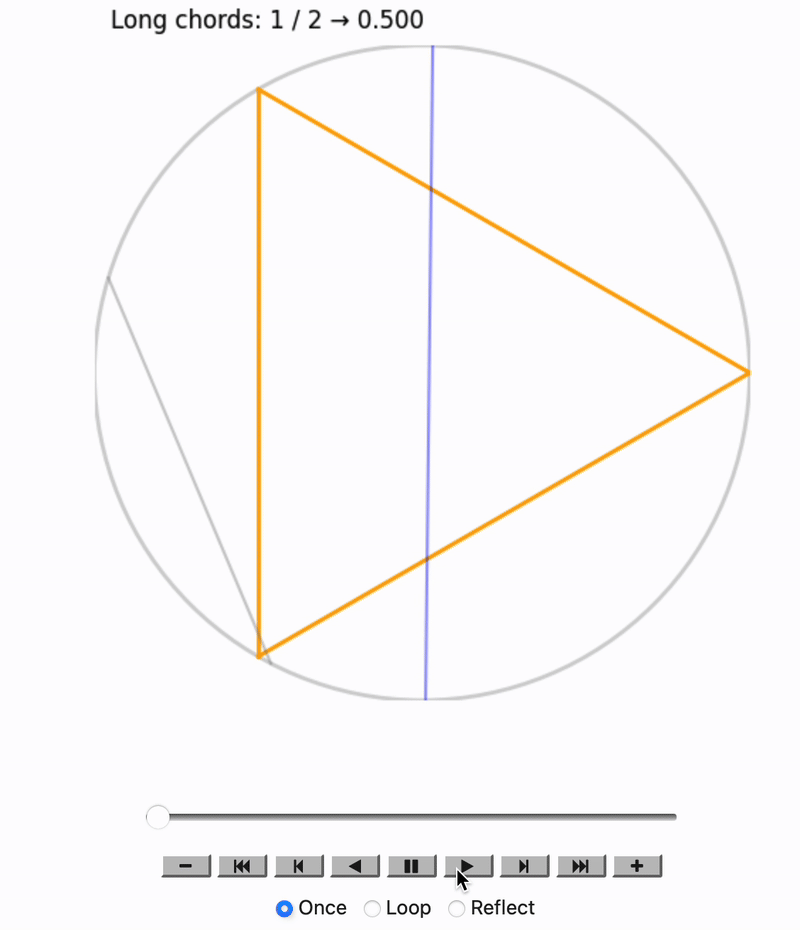
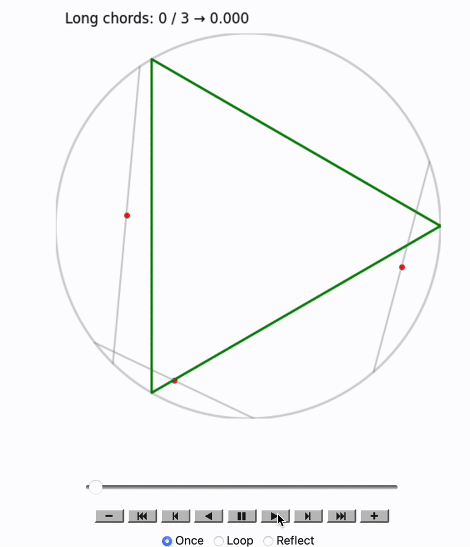
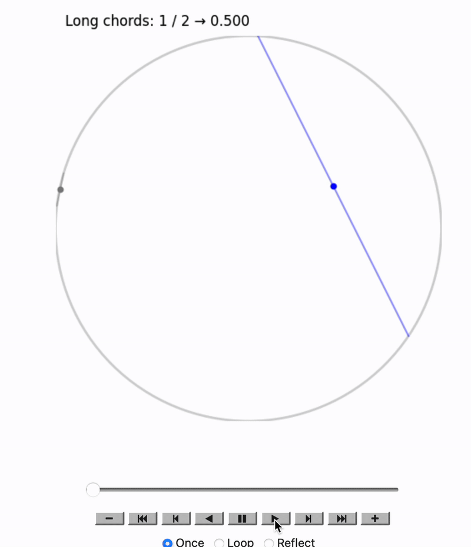

---
---

# **Geometry, Probability, and Cookies: The Curious Case of Bertrand’s Paradox**
Introduction

Hello there, little explorer! 
Today, we’re going to uncover a math mystery that even makes grown-up mathematicians scratch their heads.


It’s called **Bertrand’s Paradox**.

And it all begins with a simple, innocent-sounding question about drawing a line in a circle. Sounds easy, right? Well… buckle up because this one’s a little trickster!

---
Let us solve a simple Puzzle

Imagine you have a big round cookie (let's call it a circle), and inside it, there’s a perfectly shaped triangle with equal sides — like this:

<div align="center">
  
  <div><em>Figure-1</em></div>
</div>


Now, here’s the question:
If you draw a line (called a chord) inside this cookie, what’s the chance your line will be longer than one side of the triangle?

Think about it...

Half the time?,

A third of the time?,

Or

Maybe always?

**But wait..What’s a Chord?**

A chord is just a straight line that goes from one side of a circle to another.
Like a piece of spaghetti lying across a pizza.

<div align="center">
  
  <div><em>Figure-2</em></div>
</div>

The purple, yellow and red lines are the chords to the blue circle.
Fun fact: Diameter is also a chord, a chord that passes from the centre os the circle. 

Here’s Where the Trouble Starts…

You might think there's only one way to pick a “random” chord.
But guess what? There are many ways!

And — this is the twist — each method gives a different answer to our question.

**Three Ways to Pick a Random Chord**

Now here’s the catch:
What does it mean to “pick a random chord”?

Turns out — there are at least three natural ways, and each gives a different answer!

---
**Method 1: Random Endpoints on the Edge**

The Wikipedia definition goes as follows: The "random endpoints" method: Choose two random points on the circumference of the circle and draw the chord joining them. To calculate the probability in question imagine the triangle rotated so its vertex coincides with one of the chord endpoints. Observe that only if the other chord endpoint lies on the arc between the endpoints of the triangle side opposite the first point, the chord is longer than a side of the triangle. The length of that arc is one third of the circumference of the circle, therefore the probability that a random chord is longer than a side of the inscribed triangle is ⁠1/3.

A bit complicates, isn't it? Don't worry, I got you.

---

Imagine this.
You have a big, delicious, round cookie 🍪 lying on the table.

You close your eyes.
Poke it once with your finger.
Then, without peeking — poke it again somewhere else along the edge.

Now… connect those two pokes with a string.

<div align="center">
  
  <div><em>Figure-3</em></div>
</div>


**Congratulations!**
You’ve just drawn a chord.

But here’s the fun question:

Will your chord be longer than a magic length?
The magic length is the side of a perfectly drawn equilateral triangle sitting inside your cookie.

Spoiler:
You have a 1 out of 3 chance to win this cookie challenge!


*Let's us dive into proofs:*

Wait… What’s the Magic Length?

Inside our cookie, we draw an equilateral triangle
(That’s a triangle where all sides are equal, like a super fair pizza slice.)

Now — from geometry land:

The side length of an equilateral triangle inscribed in a circle of radius 1 is √3

Why? Because of this beautiful right-angled triangle hidden inside:

<div align="center">
  
  <div><em>Figure-4</em></div>
</div>

                                     


Using Pythagoras:

Hypotenuse = 1 (the radius of the circle)
One side = 1/2
The other = √3/2
	 
And the angles?
30°-60°-90° triangle! 

**So What’s the Chance That Your Random Chord is a Winner?**

Here’s the twist:
If you randomly pick two points on the cookie’s edge, only one-third of possible pairs will give you a chord long enough to beat our triangle’s side.

Why?
Because if you fix one point anywhere, the second point must land inside a specific arc region on the circle for the chord to be “long.”

How big is that region?
Exactly 1/3 of the circle.

Meaning: Probabailty=1/3

Let’s Put it to the Test — The Candy String Experiment!

We don't just trust math blindly. We play with it.
So let’s run a little experiment.

Idea: Pretend your computer is a candy factory robot.
It pokes the cookie thousands of times, pairs up random points, and draws chords.
Then counts how many are longer than √3

Here is the simulation:

<div align="center">
  
</div>


We color them:

Blue if the chord is longer

Grey if it’s shorter

After thousands of chords:

Count the blue ones.

Divide by total chords.
<div align="center""> <strong>35/112 = 0.312</strong> </div> <br>

Bingo! That’s super close to

<div align="center"> <strong>1/3 = 0.3333</strong> </div>

Magic confirmed ✨

**But Why Does This Work?**

This isn’t a coincidence.
Geometry is like a backstage boss, secretly pulling strings behind the curtain of randomness.

No matter how chaotically you poke your cookie’s edge, the universe (a.k.a. Euclidean geometry) quietly ensures that:

1/3 of chords will be long enough, 
2/3 will fall short

And this is why randomness isn’t as random as it seems.
 
 
*A sneak peak into the code*

```python
θ1, θ2 = np.random.uniform(0, 2*np.pi, 2)
x1, y1 = R * np.cos(θ1), R * np.sin(θ1)
x2, y2 = R * np.cos(θ2), R * np.sin(θ2)

length = np.linalg.norm([x2 - x1, y2 - y1])
is_long = length >= np.sqrt(3)  # Long if chord > triangle side

```
*You can find the notebook link at the end of the blog*

---
**Method 2: Random Point Along a Radius**

Okay — here’s how we play this one:

Imagine there’s a spinner in the middle of the cookie.

Spin it — wherever it points, that’s your direction.

Now, pick a random spot somewhere along that spinner line, from the middle of the cookie to the edge.

At that point, draw a line (a chord) going across the cookie, but it must be straight and perpendicular to your spinner line.

<div align="center">
  
  <div><em>Figure-5</em></div>
</div>


Let's dive deeper:

**When do you think the chord is long enough?**

Geometrical Fact:

The closer your point is to the center, the longer the chord you can draw through it.
As I mentioned above, the maximum chord is at the center (a diameter).
The chord's length decreases symmetrically as you move toward the edge.

Consider figure 4, A chord is longer than the side of the inscribed equilateral triangle (which has length √3) if the point is within a distance of R/2 from the center, this is the key criterion.

**Why?**

From circle geometry, the length of a chord at a perpendicular distance 
d from the center is:
   
  $$
L = 2\sqrt{R^2 - d^2}
$$

    
If you set L > √3 and solve:
$$
2\sqrt{R^2 - d^2} > \sqrt{3}
$$

Plugging \( R = 1 \):

$$
2\sqrt{1 - d^2} > \sqrt{3}
$$

Solve for \( d \):

$$
\sqrt{1 - d^2} > \frac{\sqrt{3}}{2}
$$

$$
1 - d^2 > \frac{3}{4}
$$

$$
d^2 < \frac{1}{4}
$$

$$
d < \frac{1}{2}
$$

---
**Probability Calculation:**

Since we’re uniformly choosing a point along a radius from 0 to R:

The "long chord zone" length is :R/2

The total possible length is R

So: $$
P = \frac{R/2}{R} = \frac{1}{2}
$$

 
So — we have a 50% chance of getting a long chord!

For you to better understand, here is a simulation:

<div align="center">
  
</div>


Red points mark chosen spots.
Blue chords for long, grey for short.
Here we can notice the dense cluster of points near the center generating long chords.

We can observe that the result we got from our theoretical approach and the simulated approach is approximately same.

Isn't it fascinating?! Getting different result with the same values? Mind=Blown?

*Code snippet*

```python
θ = np.random.uniform(0, 2 * np.pi)
r = np.random.uniform(0, R)  # Distance from center to midpoint

is_long = r <= R / 2  # Long if midpoint is within inner circle
```
*You can find the notebook link at the end of the blog*

---

Hold on! Before you completely get awe-struck, we have another method..let's look into it..


**Method 3: Random Midpoint Inside the Circle**

Drop a candy anywhere inside the cookie.
Then draw a chord through that point. 

<div align="center">
  
  <div><em>Figure-6</em></div>
</div>


**When Is The Chord Long Enough?**

Geometrical Fact:
The length of the longest chord you can draw through a point depends on how far the point is from the center.

At the center → longest chord (diameter)

At distance d from center → chord length: 
  $$
L = 2\sqrt{R^2 - d^2}
$$

Same check as before:

To be longer than √3:
For \( R = 1 \):

$$
2\sqrt{R^2 - d^2} > \sqrt{3}
$$

$$
d < \frac{1}{2}
$$

---

**Probability Calculation**

Now — instead of length along a line, you’re uniformly dropping candies inside the entire 2D area.

- **Area of total cookie**:

  $$
  A_{\text{total}} = \pi R^2
  $$

- **Area of "magic zone"** (a smaller circle of radius \( R/2 \)):

  $$
  A_{\text{magic}} = \pi\left(\frac{R}{2}\right)^2 = \frac{\pi R^2}{4}
  $$

So:

$$
P = \frac{A_{\text{magic}}}{A_{\text{total}}}
= \frac{\pi R^2 / 4}{\pi R^2}
= \frac{1}{4}
$$

So — you have a 25% chance of getting a long chord!

Let's us observe these through simulations:

<div align="center">
  
</div>


We dropped random points inside the circle and then drew chords through those midpoints.
Counted those within R/2 from center as “long chords” (blue). Grey points for short ones.

Notice how blue points cluster inside an invisible smaller circle at the center — precisely as theory predicts.


Our result: 0.248

Nearly perfect match to expected 0.25.

*Code snippet*


```python
while True:
    x, y = np.random.uniform(-R, R, 2)
    if x**2 + y**2 <= R**2:
        break  # Ensure point is inside circle

d = np.sqrt(x**2 + y**2)
is_long = d <= R / 2  # Long if distance to center ≤ R/2
```
*You can find the notebook link at the end of the blog*

---

Bertrand’s Paradox lies in the ambiguity of what we mean by "random chord."
Each method uses a different definition of randomness:


| Method | Random Variable| Probability of Long Chord|
| -------- | -------- | -------- |
|   1    |Random pair of points on circumference   | 1/3    
|   2    |Random point along a radius	           | 1/2 
|   3    |Random midpoint inside the circle	       | 1/4


**✨ Bertrand’s Paradox Reminder:**

The paradox comes from the fact that the meaning of “random chord” depends on how you randomize — edge points, radial points, or midpoints give different probabilities.

Key lesson:

In continuous probability, the way you define “randomness” affects outcomes — probability isn’t just about counting equally likely cases in geometry.
Context matters.

---
Codes:
[View the notebook here](Code.ipynb)


*Make sure to play with the codes..;D*

Tip: Run it in Jupyter notebook for better animations

---

**Closing Thought**

Same cookie. Same chords. Different ways of choosing — different probabilities.

Probability is not just about outcomes, but also about how you select them.

This is why Bertrand’s Paradox isn’t a flaw in probability theory — it’s a brilliant reminder to be precise in defining your randomness.

We hope this journey through three different methods of drawing random chords, complete with animations and simulations, gave you both a clear understanding of how definitions shape outcomes, and a little sense of the beauty hidden in probability puzzles.

---
📖 Published by:
Ankeshwar Ruthesha and Pasala Greeshma

Two math-and-coffee enthusiasts ☕✨ who believe every paradox hides a story worth telling.

---

**References**

[https://en.wikipedia.org/wiki/Bertrand_paradox_(probability)](https://)

[https://www.uio.no/studier/emner/matnat/math/MAT4010/data/forelesningsnotater/w-bertrand-paradox-(probability).pdf](https://)


